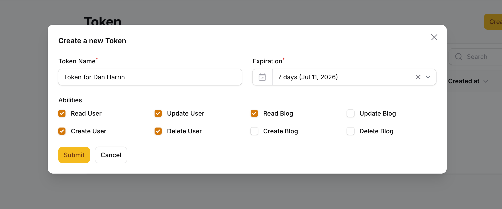
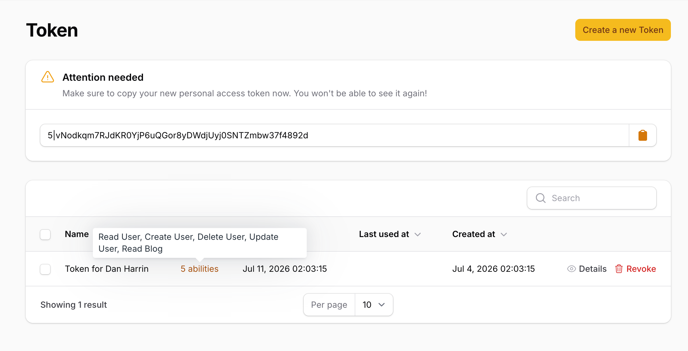

# Filament Sanctum

Manage Laravel Sanctum personal access tokens from your Filament panel.

<p align="center">
    
    
</p>

## Installation

Install the package and Sanctum:

```bash
composer require devtical/filament-sanctum laravel/sanctum
```

Publish Sanctum and run migrations:

```bash
php artisan vendor:publish --provider="Laravel\Sanctum\SanctumServiceProvider"
php artisan migrate
```

Add the `HasApiTokens` trait to your user model:

```php
use Laravel\Sanctum\HasApiTokens;

class User extends Authenticatable
{
    use HasApiTokens;
}
```

Register the plugin in your Filament panel provider:

```php
use Devtical\Sanctum\SanctumPlugin;

public function panel(Panel $panel): Panel
{
    return $panel
        // ...
        ->plugin(SanctumPlugin::make());
}
```

Publish the package config (optional):

```bash
php artisan vendor:publish --tag=filament-sanctum-config
```

Publish translations (optional):

```bash
php artisan vendor:publish --tag=filament-sanctum-translations
```

## Configuration

### Navigation

By default, the Sanctum page appears in the **user menu**. To show it in the sidebar instead:

```php
// config/filament-sanctum.php
'navigation' => [
    'slug' => 'sanctum',
    'sidebar_menu' => [
        'enabled' => true,
    ],
    'user_menu' => [
        'enabled' => false,
    ],
],
```

### Abilities

Customize the abilities available when creating a token:

```php
'abilities' => [
    'columns' => 4,
    'allow_expiration' => true,
    'default_expiration_days' => 30,
    'expiration_presets' => [7, 30, 60, 90],
    'list' => [
        'posts:read' => 'Read posts',
        'posts:write' => 'Write posts',
    ],
],
```

### Authorization

Restrict access to the Sanctum page using a Laravel gate:

```php
'authorization' => [
    'enabled' => true,
    'gate' => 'manage-api-tokens',
],
```

Define the gate in a service provider:

```php
Gate::define('manage-api-tokens', fn (User $user) => $user->isAdmin());
```

## Testing

```bash
composer test
```

Format code:

```bash
composer format
```

## Changelog

Please see [CHANGELOG](CHANGELOG.md) for more information on what has changed recently.

## Contributing

Please see [CONTRIBUTING](CONTRIBUTING.md) for details.

## Security

If you discover any security related issues, please email `w.kristories@gmail.com` instead of using the issue tracker.

## Credits

- [W Kristianto](https://github.com/kristories)
- [All Contributors](https://github.com/devtical/filament-sanctum/graphs/contributors)

## License

The MIT License (MIT). Please see [License File](LICENSE.md) for more information.
