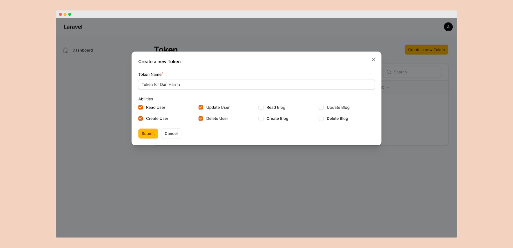

# Filament Sanctum

<p align="center">
    
    
</p>

## Installation

You can install the package via composer:

```bash
composer require devtical/filament-sanctum
```

Config: 

```bash
php artisan vendor:publish --tag=filament-sanctum-config
```

```php
return [

    'abilities' => [
        'users:read' => 'Read User',
        'users:create' => 'Create User',
        'users:update' => 'Update User',
        'users:delete' => 'Delete User',
        'blog:read' => 'Read Blog',
        'blog:create' => 'Create Blog',
        'blog:update' => 'Update Blog',
        'blog:delete' => 'Delete Blog',
    ],
    'columns' => 4,
    'navigation_menu' => true,
    'user_menu' => false,
    'label' => 'Sanctum',
    'slug' => 'sanctum',

];
```

Translations:

```bash
php artisan vendor:publish --tag=filament-sanctum-translations
```

## Testing

```bash
composer test
```

## Changelog

Please see [CHANGELOG](CHANGELOG.md) for more information on what has changed recently.

## Contributing

Please see [CONTRIBUTING](CONTRIBUTING.md) for details.

## Security

If you discover any security related issues, please email `w.kristories@gmail.com` instead of using the issue tracker.

## Credits

- [Wahyu Kristianto](https://github.com/kristories)
- [All Contributors](https://github.com/devtical/sanctum/graphs/contributors)

## License

The MIT License (MIT). Please see [License File](LICENSE.md) for more information.
